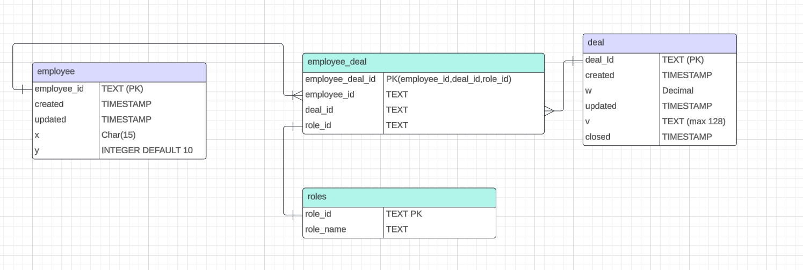

#### Running the node tests
```
cd knock-test
npm install
npm test
```

## Exercise 1
Right out of the gate, I knew this one was going to be the biggest challenge for me - I'm the first to admit that my database design skills are probably one of my weaker areas. (I saved this one for last)

Achieving the many-to-many relationship between deals and employees using a join table seemed like an obvious choice to me:


You may notice I decided to normalize the id names a little bit.  I find it easier to reason about when tables share the same column name on fields, for examle instead of each table having an `id` field, I used more descriptive names so the foreign keys would be clearer. 

Also, making the primary key of that table compound with `employee_id`, `deal_id`, and `role_id` seems like a good way to ensure that an employee can be assigned to multiple roles in a deal. Without `role_id` in that primary key, an employee would not be able to have multiple roles in the same deal.

I also added a `closed` column to the `deal` table.  This would just be another time stamp to mark when the deal was closed.  If it has a `closed` timestamp, this allows you to query for only deals that are still open.

This is where my confidence ended though - thinking of tracking all of the changes that happened to a deal over time is definitely a challenge for me.  One idea I had was to use a `trigger` anytime a `deal` gets assigned a role, which could write the change to another table in the database.  


## Question 2
Reading betweent he lines, I think the key here was to optmize the system to be able to easily add different data MLS structures as time goes on.  I elected to give each MLS type a `config` that has a JSON schema used for input validation, as well as a `mapper` function which mapped that (validated) value to the request structure that the CRM `POST` request was expecting.  So, theoretically, if more MLS structures pop up in the future, you just have to create a `mapper` function and a JSON schema.  Ultimately I felt the JSON schema validation was necessary in case MLS structures have some common fields with others.  It must satisfy a schema completely - and when it does, we know that we can safely map to the expected input value.  I used a neat tool called `typescript-json-schema` to generate JSON schemas from TypeScript definitions (way easier than writing JSON schema by hand). Ultimately, scripting with that to create template `ts` files for new schemas would be slick.

I made some assumptions during this:
1. I noticed that the sample data from [here](https://gist.github.com/pkat/5e7c19d71b02e8011ee19974089cd6ed) for `a` and `b` each were a singular object in an Array, and the instructions said that the function should only accept 1 value input. So my tests use just the object (not in an array).  If it did need to be wrapped in an array, it would be a pretty simple fix in the code to accomodate for that, but I just made an assumption to keep things moving.  
2. The instructions also said `Keep in mind that the data sources will grow with each new city we add so try and think through the implications of this.`, and I interpreted that as each new MLS structure that gets added in the future. Sorry if I misunderstood something. 
3. In both `a` and `b`, even the completely numeric fields were strings. I assumed this was intentional so I parsed any value that needed to be a number.
4.  I'm not sure in this exercise how much control we have over the CRM endpoint's request body, but if I could I would definitely change `zip` to be a string and not a number.  Leading `0`s can cause parsing problems. 

## Question 3
This was a fun one to think about, and I resorted to a bit of recursion to get the job done.  In my opinion it's a clean way of handling that, and I'm definitely someone who appreciates functional programming. 

## Question 4
One thing that comes to mind for this is in my current role, I recently built out an entire front end for users to configure their weather targeting with their Meta advertisements - it uses Meta's oAuth token workflow for authorization, and I had to learn (re-learn?) a lot of front-end dev in a short amount of time to get it out quickly for our clients.  Given that it had been a little while since I did UI, I'm pretty proud to have something out there that clients use everyday.  

## Question 5
As far as tech specific problems or areas that I get excited about, lately it has been metrics and dashboards, as silly as that sounds.  I've had some fun with Datadog in my current role building dashboards, specifically for monitoring our Kubernetes clusters.  Things like tracking CPU and memory used accorss nodes, pod uptimes, etc.  These come in handy when we get alerted to production issues.  It's nice to have a quick birds eye view of the system as a whole.

Also, if I could drop everything and work on something, I would love to build some type of application for interactive music lessons, something like a way to practice guitar (or any instrument).  Some type of application that can analyze accuracy and give you feedback on a performance, and aid in writing of songs, melodies, etc.